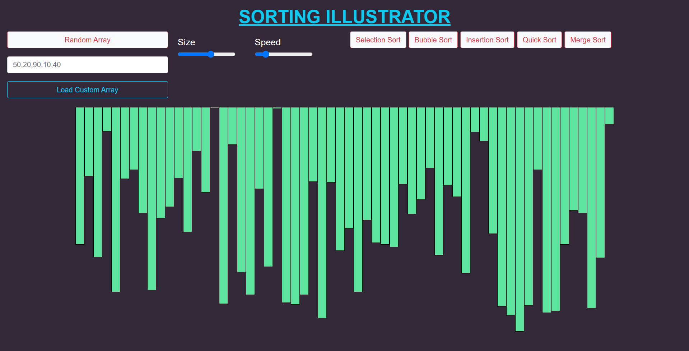
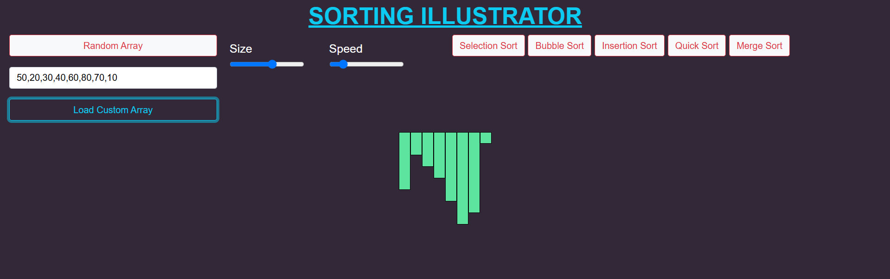
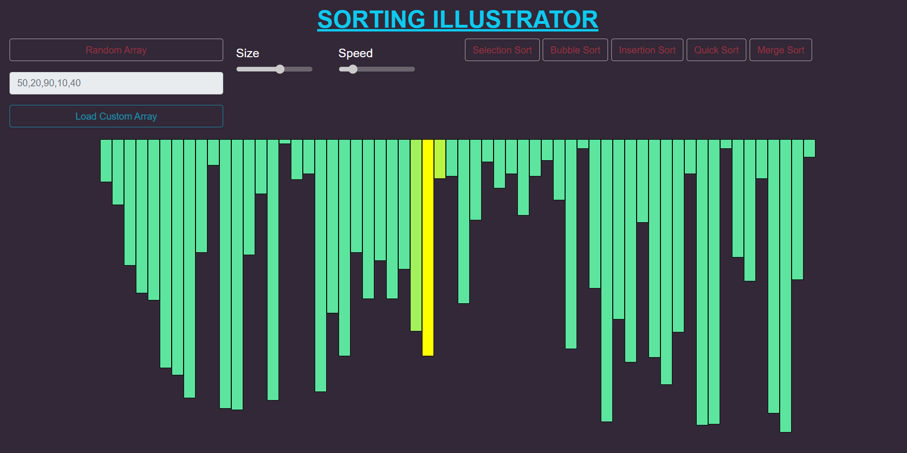
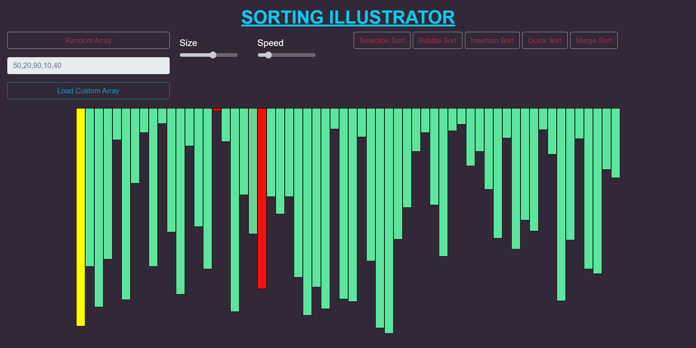
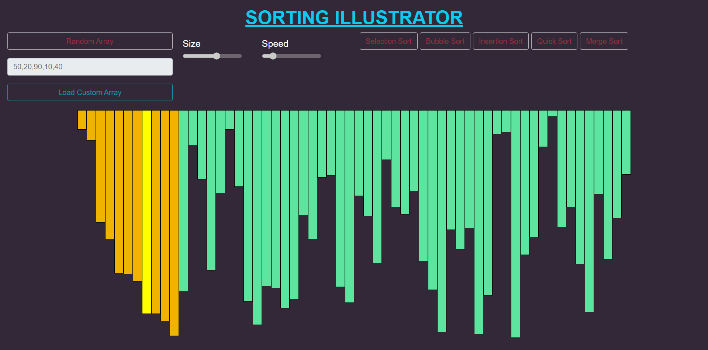
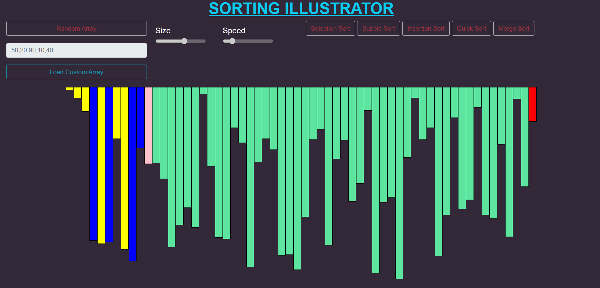
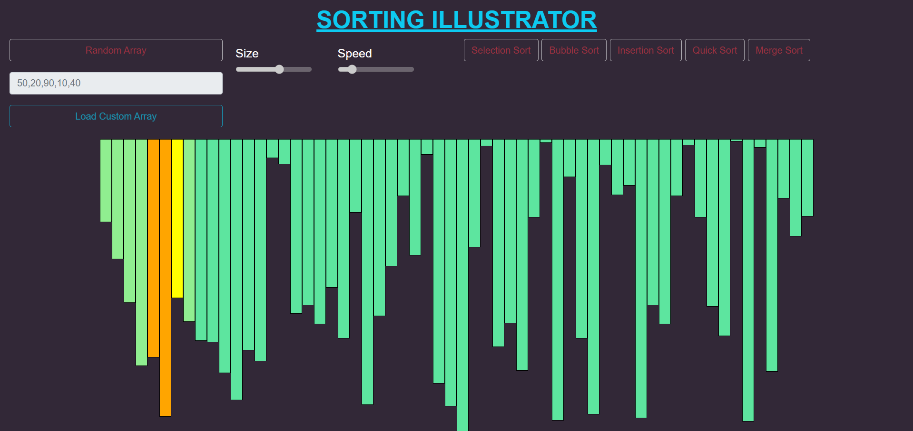

# Sorting Illustrator

A web-based sorting algorithm visualizer built using HTML, CSS, JavaScript, and Bootstrap. The project helps users understand how popular sorting algorithms work through animated bar visualizations.

### Main Interface

## Features

- Random array generation
- Custom array input support
- Adjustable array size
- Adjustable sorting speed
- Interactive sorting visualizations
- Color-coded sorting animations

## Implemented Algorithms

- Bubble Sort
- Selection Sort
- Insertion Sort
- Merge Sort
- Quick Sort

## Technologies Used

- HTML5
- CSS3
- JavaScript (ES6)
- Bootstrap 5

## How to Use

1. Generate a random array or enter your own custom array.
2. Adjust the array size and animation speed.
3. Select a sorting algorithm.
4. Watch the sorting process step-by-step.

## Custom Array Example

Input:

50,20,90,10,40

Click **Load Custom Array** to visualize and sort your own data.

## Screenshots

### Custom Array Input

### Bubble Sort

### Selection Sort

### Insertion Sort

### Quick Sort

### Merge Sort

## Future Enhancements

- Pause and Resume functionality
- Heap Sort visualization
- Radix Sort visualization
- Sorting statistics (comparisons and swaps)
- Time and Space Complexity display

## Author

Mahathi Reddy